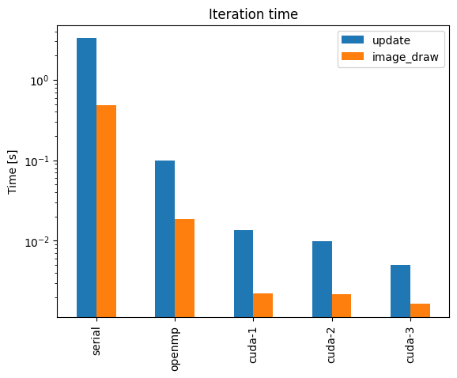

# Reiter's local cellular model for snow crystal growth

[Reiter's local cellular model for snow crystal growth](https://doi.org/10.1016/j.chaos.2004.06.071) sped up using **OpenMP** and **CUDA**.

The idea is similar to [Conway's Game of Life](https://github.com/mare5x/ConwaysGameOfLife), but with different rules and using a hexagonal grid.
For a description of the model and other interesting snow crystal parameters check out Reiter's paper.


The following solutions are implemented:
- [serial](./src/serial.c) serial version.
- [openmp](./src/openmp.c) multi-threading using OpenMP.
- [cuda-1](./src/cuda-1.cu) basic CUDA version.
- [cuda-2](./src/cuda-2.cu) improved CUDA version using shared memory.
- [cuda-3](./src/cuda-3.cu) splits computation among multiple GPUs (on a single node).

# Benchmarks




Results for a 3200 x 3200 grid and 2000 iterations.
|      |   serial |   openmp |   cuda-1 |   cuda-2 |   cuda-3 |
|-----:|---------:|---------:|---------:|---------:|---------:|
| Iteration time [s] |   3.2793 |   0.0991 |   0.0135 |   0.0099 |   0.0050 |
| Iteration speedup |   1  |     33.0855 |   242.2377 |   331.4498 |   661.0083 |
| Image draw time [s] |   0.4849 |   0.0185 |   0.0022 |   0.0022 |   0.0016 |
| Image draw speedup |    1 |     26.1455 |   220.9350 |   223.2132 |   296.4358 |
| Total time [s] | 6567.2559 | 200.9719 |  31.1356 |  23.6711 |  15.2646 |

## Reproducing results

- The code for running benchmarks is written for a HPC cluster which uses SLURM. To run locally, you will need to modify the scripts manually.
1. Submit batch jobs: `scripts/compare_all.sh` and `scripts/compare_cuda.sh`
2. When all jobs are complete, create comparison plots using: `python scripts/compare_all.py` and `python scripts/compare_cuda.py`

# Setup

You will need `gcc` and `nvcc` compilers.

For convenience you can compile the code with different [constants](./src/constants.h) using the `-D` compiler flag.
Example:
```bash
./scripts/clean.sh  # prepare output directories
./scripts/cuda-2.sh -D ROWS=2000 -D COLS=2000 -D ITERS=2000
```
